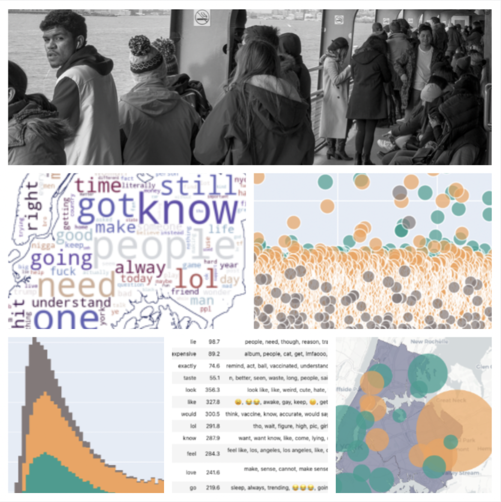

 

  <h3 align="center">Why, New York City? Gauging the Quality of Life Through the Thoughts of Tweeters</h3>
  

    <i>A brief README guide created to accompany this capstone project.</i>
     
    <a href="https://shewilliams.github.io/whynyc/" target="_blank">Website</a>
    ·
    <a href="https://github.com/shewilliams/whynyc/blob/main/whitepaper.pdf" target="_blank">White Paper</a>
  

  

<!-- TABLE OF CONTENTS -->
<!--
 -->
  
Table of Contents

  <ol>
    <li>
      <a href="#about-the-project">About The Project</a>
    </li>
    <li>
        <a href="#built-with">Built With</a>
    </li>
    <li>
      <a href="#getting-started">Getting Started</a>
    </li>
    <!--<li><a href="#license">License</a></li>-->
    <li><a href="#contact">Contact</a></li>
  </ol>
<!--
-->

 
 

<!-- ABOUT THE PROJECT -->
### About The Project
 

 

This master's capstone project explores the quality of life narrative in geographical areas, primarily New York City and Los Angeles. Querying Twitter's public data around the keyword "why," topic modeling and sentiment analysis techniques are used to determine the narrative of the most discussed ideas. Below is a brief overview of what is contained in this project. For more information, please review the appendices in the white paper.

(<a href="#top">back to top</a>)

### Built With

This section entails the software and Python libraries used to put together this project.

* [Python](https://www.python.org)
* [Anaconda + Jupyter](https://www.anaconda.com)
* [Visual Studio Code](https://code.visualstudio.com)

* [searchtweets-v2](https://pypi.org/project/searchtweets-v2/)
* [nltk](https://www.nltk.org/)
* [contractions](https://pypi.org/project/contractions/)
* [wordcloud](https://amueller.github.io/word_cloud/)
* [sklearn](https://scikit-learn.org/stable/)
* [plotly](https://plotly.com/python/)
* [geopandas](https://geopandas.org/en/stable/)
* [textblob](https://textblob.readthedocs.io/en/dev/)

(<a href="#top">back to top</a>)

<!-- GETTING STARTED -->
### Getting Started

In the main directory of this repository, the following are included: 
* <b>code</b> - includes all files for Python coding.
* <b>img</b> - contains images used for website and README.md file.
* <b>figures</b> - contains charts created in Python coding. Labeled according title in white paper.
* <b>tables</b> - contains dataframes created in Python coding. Labeled according title in white paper.
* <b>whitepaper</b> - In-depth breakdown of the approach to this project.
* <b>la.html</b> - Exported Plotly HTML file from Python. A topic bubble map for LA.
* <b>nyc.html</b> - Exported Plotly HTML file from Python. A topic bubble map for NYC.
* <b>style.css</b> - styling sheet for website

If you're interested in the Python coding, please look at the <b>code</b> folder. Everything needed for the analysis is in that folder. All other files are either for the website or accompanies the white paper. An alternative is to download at the ZIP files (whynyc.zip and whynyc-code.zip) provided.

(<a href="#top">back to top</a>)

<!-- LICENSE 
### License

Distributed under the MIT License. See `LICENSE.txt` for more information.

(<a href="#top">back to top</a>)
-->

<!-- CONTACT -->
### Contact

Sheryl Williams - swilliams7@gradcenter.cuny.edu

Project Link: [https://github.com/shewilliams/whynyc](https://github.com/shewilliams/whynyc)

(<a href="#top">back to top</a>)

